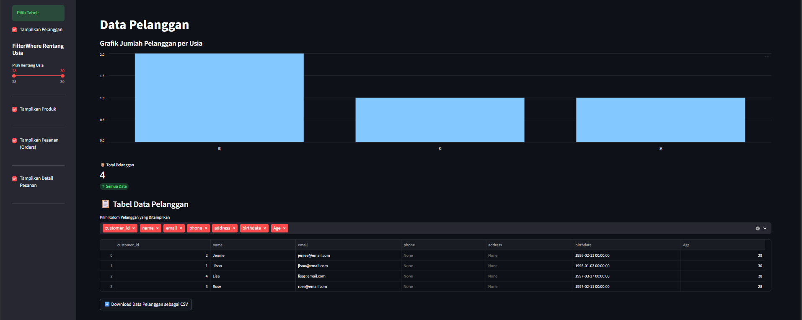
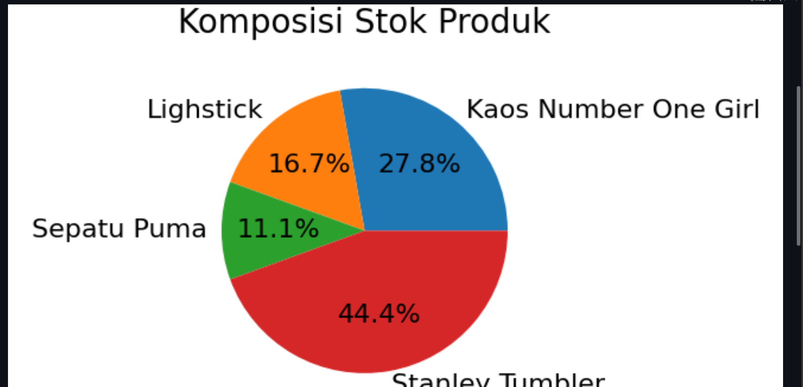
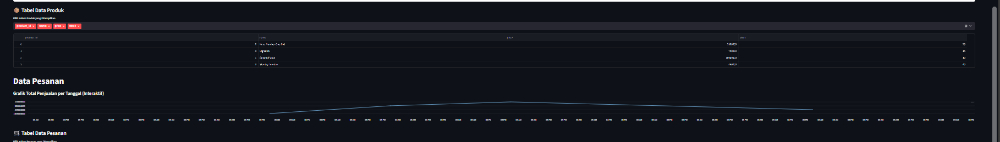
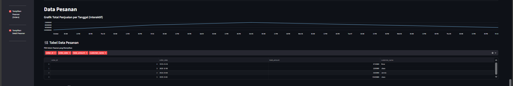
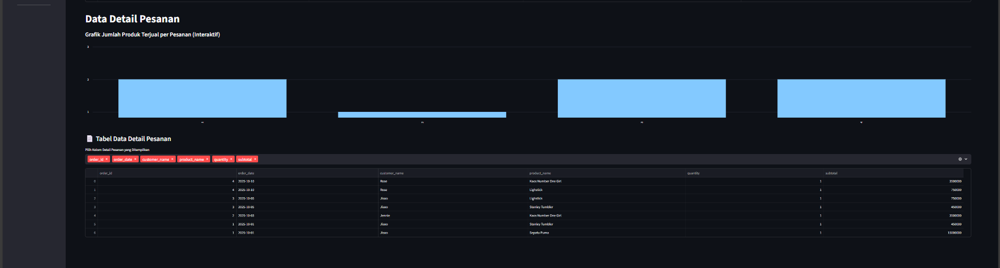

# Dashboard Visualisasi Data

## Biodata
Debora Intania Subekti 10231029

## Dokumentasi Visualisasi Data






## Script Main.py
```
# Import library
import streamlit as st
import pandas as pd
import numpy as np
from datetime import datetime

# Import fungsi dari config.py
from config import *

# Set konfigurasi halaman dashboard
st.set_page_config("Dashboard", page_icon="📊", layout="wide")  

# Ambil data pelanggan
result_customers = view_customers()

df_customers = pd.DataFrame(result_customers, columns=[
    "customer_id", "name", "email", "phone", "address", "birthdate", 
])

# Hitung usia dari birthdate
df_customers['birthdate'] = pd.to_datetime(df_customers['birthdate']) 
df_customers['Age'] = (datetime.now() - df_customers['birthdate']).dt.days // 365 


# Fungsi tampilkan tabel + export CSV + visualisasi
def tabelCustomers_dan_export():
    import matplotlib.pyplot as plt
    import seaborn as sns
    # Visualisasi: Bar chart jumlah pelanggan per usia
    st.markdown("#### Grafik Jumlah Pelanggan per Usia")
    usia_count = df_customers['Age'].value_counts().sort_index()
    st.bar_chart(usia_count)

    total_customers = df_customers.shape[0]
    col1, col2, col3 = st.columns(3)
    with col1:
        st.metric(label="Total Pelanggan", value=total_customers, delta="Semua Data")

    st.sidebar.header("FilterWhere Rentang Usia")
    min_age_val = df_customers['Age'].min()
    max_age_val = df_customers['Age'].max()
    min_age = int(min_age_val) if not np.isnan(min_age_val) else 0
    max_age = int(max_age_val) if not np.isnan(max_age_val) else 0
    if min_age < max_age:
        age_range = st.sidebar.slider(
            "Pilih Rentang Usia",
            min_value=min_age,
            max_value=max_age,
            value=(min_age, max_age)
        )
        filtered_df = df_customers[df_customers['Age'].between(*age_range)]
        st.markdown("### Tabel Data Pelanggan")
        showdata = st.multiselect(
            "Pilih Kolom Pelanggan yang Ditampilkan",
            options=filtered_df.columns,
            default=["customer_id", "name", "email", "phone", "address", "birthdate", "Age"],
            key="multiselect_pelanggan"
        )
        st.dataframe(filtered_df[showdata], use_container_width=True)
        @st.cache_data
        def convert_df_to_csv(_df):
            return _df.to_csv(index=False).encode('utf-8')
        csv = convert_df_to_csv(filtered_df[showdata])
        st.download_button(
            label="Download Data Pelanggan sebagai CSV",
            data=csv,
            file_name='data_pelanggan.csv',
            mime='text/csv'
        )
    else:
        st.sidebar.warning("Data usia pelanggan tidak tersedia atau tidak valid.")
        st.markdown("###Tabel Data Pelanggan")
        st.info("Tidak ada data pelanggan yang dapat ditampilkan.")
    
# --- Sidebar untuk memilih tampilan ---
st.sidebar.success("Pilih Tabel:")

if st.sidebar.checkbox("Tampilkan Pelanggan", value=True): 
    st.title("Data Pelanggan")
    tabelCustomers_dan_export()
    st.sidebar.markdown("---") 


def tabelProducts_dan_export():
    import matplotlib.pyplot as plt
    result_products = view_products()
    df_products = pd.DataFrame(result_products, columns=[
        "product_id", "name", "description", "price", "stock"
    ])
    st.markdown("#### Grafik Komposisi Stok Produk (Pie Chart)")
    fig2, ax2 = plt.subplots(figsize=(4,2))
    ax2.pie(df_products['stock'], labels=df_products['name'], autopct='%1.1f%%', textprops={'fontsize': 8})
    ax2.set_title('Komposisi Stok Produk', fontsize=10)
    fig2.tight_layout()
    st.pyplot(fig2, use_container_width=True)
    st.markdown("### Tabel Data Produk")
    showdata = st.multiselect(
        "Pilih Kolom Produk yang Ditampilkan",
        options=df_products.columns,
        default=["product_id", "name", "price", "stock"],
        key="multiselect_produk"
    )
    st.dataframe(df_products[showdata], use_container_width=True)

if st.sidebar.checkbox("Tampilkan Produk"):
    st.title("Data Produk")
    tabelProducts_dan_export()
    st.sidebar.markdown("---")


def tabelOrders_dan_export():
    import matplotlib.pyplot as plt
    result_orders = view_orders_with_customers()
    df_orders = pd.DataFrame(result_orders, columns=[
        "order_id", "order_date", "total_amount", "customer_name", "phone"
    ])
    df_orders['order_date'] = pd.to_datetime(df_orders['order_date']).dt.date
    st.markdown("#### Grafik Total Penjualan per Tanggal (Interaktif)")
    df_orders_group = df_orders.groupby('order_date')['total_amount'].sum().reset_index()
    df_orders_group = df_orders_group.set_index('order_date')
    st.line_chart(df_orders_group)
    st.markdown("###Tabel Data Pesanan")
    showdata = st.multiselect(
        "Pilih Kolom Pesanan yang Ditampilkan",
        options=df_orders.columns,
        default=["order_id", "order_date", "total_amount", "customer_name"],
        key="multiselect_orders"
    )
    st.dataframe(df_orders[showdata], use_container_width=True)

if st.sidebar.checkbox("Tampilkan Pesanan (Orders)"):
    st.title("Data Pesanan")
    tabelOrders_dan_export()
    st.sidebar.markdown("---")


def tabelOrderDetails_dan_export():
    import matplotlib.pyplot as plt
    result_details = view_order_details_with_info()
    df_details = pd.DataFrame(result_details, columns=[
        "detail_id", "order_id", "order_date", "customer_id", 
        "customer_name", "product_id", "product_name", "unit_price", 
        "quantity", "subtotal", "order_total", "phone"
    ])
    df_details['order_date'] = pd.to_datetime(df_details['order_date']).dt.date
    st.markdown("#### Grafik Jumlah Produk Terjual per Pesanan (Interaktif)")
    df_details_group = df_details.groupby('order_id')['quantity'].sum().reset_index()
    df_details_group = df_details_group.set_index('order_id')
    st.bar_chart(df_details_group)
    st.markdown("### 📄 Tabel Data Detail Pesanan")
    showdata = st.multiselect(
        "Pilih Kolom Detail Pesanan yang Ditampilkan",
        options=df_details.columns,
        default=["order_id", "order_date", "customer_name", "product_name", "quantity", "subtotal"],
        key="multiselect_details"
    )
    st.dataframe(df_details[showdata], use_container_width=True)

if st.sidebar.checkbox("Tampilkan Detail Pesanan"):
    st.title("Data Detail Pesanan")
    tabelOrderDetails_dan_export()
    st.sidebar.markdown("---")

# Fungsi untuk memvisualisasikan data Products
def tabelProducts_dan_export():

    # 1. Ambil data produk
    result_products = view_products()
    df_products = pd.DataFrame(result_products, columns=[
        "product_id", "name", "description", "price", "stock"
    ])

    # 2. Hitung metrik
    total_products = df_products.shape[0]
    col1, col2, col3 = st.columns(3)
    with col1:
        st.metric(label="Total Produk", value=total_products, delta="Semua Data")

    # 3. Sidebar: Filter Stok
    st.sidebar.header("Filter Stok Produk")
    min_stock = int(df_products['stock'].min())
    max_stock = int(df_products['stock'].max())
    stock_range = st.sidebar.slider(
        "Pilih Rentang Stok",
        min_value=min_stock,
        max_value=max_stock,
        value=(min_stock, max_stock)
    )

    # 4. Terapkan filter stok
    filtered_df = df_products[df_products['stock'].between(*stock_range)]

    # 5. Tampilkan tabel
    st.markdown("### Tabel Data Produk")
    
    showdata = st.multiselect(
        "Pilih Kolom Produk yang Ditampilkan",
        options=filtered_df.columns,
        default=["product_id", "name", "price", "stock"]
    )
    
    st.dataframe(filtered_df[showdata], use_container_width=True) 

    # 6. Fungsi Helper Export CSV (Bisa diletakkan di luar atau di dalam fungsi)
    @st.cache_data
    def convert_df_to_csv(_df):
        return _df.to_csv(index=False).encode('utf-8')
    
    csv = convert_df_to_csv(filtered_df[showdata])
    st.download_button(
        label="⬇ Download Data Produk sebagai CSV",
        data=csv,
        file_name='data_produk.csv',
        mime='text/csv'
    )

# Fungsi Visualisasi Data Orders
def tabelOrders_dan_export():
    # 1. Ambil data orders
    result_orders = view_orders_with_customers()
    df_orders = pd.DataFrame(result_orders, columns=[
        "order_id", "order_date", "total_amount", "customer_name", "phone"
    ])
    
    df_orders['order_date'] = pd.to_datetime(df_orders['order_date']).dt.date # Hanya ambil tanggalnya

    # 2. Hitung metrik
    total_orders = df_orders.shape[0]
    total_sales = df_orders['total_amount'].sum()
    col1, col2, col3 = st.columns(3)
    with col1:
        st.metric(label=" Total Pesanan", value=total_orders, delta="Jumlah Transaksi")
    with col2:
        st.metric(label=" Total Penjualan", value=f"Rp {total_sales:,.2f}", delta="Pendapatan Bruto")

    # 3. Sidebar: Filter Total Jumlah
    st.sidebar.header("Filter Total Pesanan")
    min_amount = float(df_orders['total_amount'].min())
    max_amount = float(df_orders['total_amount'].max())
    amount_range = st.sidebar.slider(
        "Pilih Rentang Total Pesanan",
        min_value=min_amount,
        max_value=max_amount,
        value=(min_amount, max_amount)
    )

    # 4. Terapkan filter jumlah
    filtered_df = df_orders[df_orders['total_amount'].between(*amount_range)]

    # 5. Tampilkan tabel
    st.markdown("### Tabel Data Pesanan (Orders)")
    
    showdata = st.multiselect(
        "Pilih Kolom Pesanan yang Ditampilkan",
        options=filtered_df.columns,
        default=["order_id", "order_date", "total_amount", "customer_name"]
    )
    
    st.dataframe(filtered_df[showdata], use_container_width=True) 

    # 6. Export CSV
    @st.cache_data
    def convert_df_to_csv(_df):
        return _df.to_csv(index=False).encode('utf-8')
    
    csv = convert_df_to_csv(filtered_df[showdata])
    st.download_button(
        label="⬇ Download Data Pesanan sebagai CSV",
        data=csv,
        file_name='data_pesanan.csv',
        mime='text/csv'
    )

# Fungsi Visualisasi Order Details 
def tabelOrderDetails_dan_export():
    # 1. Ambil data order details
    result_details = view_order_details_with_info()
    df_details = pd.DataFrame(result_details, columns=[
        "order_detail_id", "order_id", "order_date", "customer_id", 
        "customer_name", "product_id", "product_name", "unit_price", 
        "quantity", "subtotal", "order_total", "phone"
    ])
    
    df_details['order_date'] = pd.to_datetime(df_details['order_date']).dt.date # Hanya ambil tanggalnya

    # 2. Hitung metrik
    total_items = df_details['quantity'].sum()
    total_subtotal = df_details['subtotal'].sum()
    col1, col2, col3 = st.columns(3)
    with col1:
        st.metric(label=" Total Item Terjual", value=total_items, delta="Jumlah Fisik Barang")
    with col2:
        st.metric(label=" Total Subtotal", value=f"Rp {total_subtotal:,.2f}", delta="Penjualan Item")

    # 3. Sidebar: Filter Kuantitas
    st.sidebar.header("Filter Kuantitas Item")
    min_qty = int(df_details['quantity'].min())
    max_qty = int(df_details['quantity'].max())
    qty_range = st.sidebar.slider(
        "Pilih Rentang Kuantitas",
        min_value=min_qty,
        max_value=max_qty,
        value=(min_qty, max_qty)
    )

    # 4. Terapkan filter kuantitas
    filtered_df = df_details[df_details['quantity'].between(*qty_range)]

    # 5. Tampilkan tabel
    st.markdown("### Tabel Data Detail Pesanan (Order Details)")
    
    showdata = st.multiselect(
        "Pilih Kolom Detail Pesanan yang Ditampilkan",
        options=filtered_df.columns,
        default=["order_id", "order_date", "customer_name", "product_name", "quantity", "subtotal"]
    )
    
    st.dataframe(filtered_df[showdata], use_container_width=True) 

    # 6. Export CSV
    @st.cache_data
    def convert_df_to_csv(_df):
        return _df.to_csv(index=False).encode('utf-8')
    
    csv = convert_df_to_csv(filtered_df[showdata])
    st.download_button(
        label= Download Data Detail Pesanan sebagai CSV",
        data=csv,
        file_name='data_detail_pesanan.csv',
        mime='text/csv'
    )
```

## Script config.py
```
import psycopg2

# Koneksi ke database PostgreSQL
conn = psycopg2.connect(
    host="localhost",
    port="5432",          # port default PostgreSQL
    user="postgres",      # ganti sesuai user PostgreSQL kamu
    password="JANGANLUPALAGI20",  # ganti sesuai password PostgreSQL kamu
    dbname="sales_db"     # nama database
)

print("Koneksi PostgreSQL berhasil!")

# Membuat cursor
c = conn.cursor()

def view_customers():
    query = '''
        SELECT customer_id, name, email, phone, address, birthdate
        FROM customers
        ORDER BY name ASC
    '''
    c.execute(query)
    return c.fetchall()

def view_orders_with_customers():
    query = '''
        SELECT 
            o.order_id, 
            o.order_date, 
            o.total_amount, 
            c.name AS customer_name, 
            c.phone 
        FROM orders o
        JOIN customers c ON o.customer_id = c.customer_id
        ORDER BY o.order_date DESC
    '''
    c.execute(query)
    return c.fetchall()

def view_products():
    query = '''
        SELECT product_id, name, description, price, stock
        FROM products
        ORDER BY name ASC
    '''
    c.execute(query)
    return c.fetchall()

def view_order_details_with_info():
    query = '''
        SELECT 
            od.detail_id,
            o.order_id,
            o.order_date,
            c.customer_id,
            c.name AS customer_name,
            p.product_id,
            p.name AS product_name,
            p.price AS unit_price,
            od.quantity,
            (od.quantity * od.price) AS subtotal,
            o.total_amount AS order_total,
            c.phone
        FROM order_details od
        JOIN orders o ON od.order_id = o.order_id
        JOIN customers c ON o.customer_id = c.customer_id
        JOIN products p ON od.product_id = p.product_id
        ORDER BY o.order_date DESC
    '''
    c.execute(query)
    return c.fetchall()


    # Tutup koneksi
    c.close()
    conn.close()
```